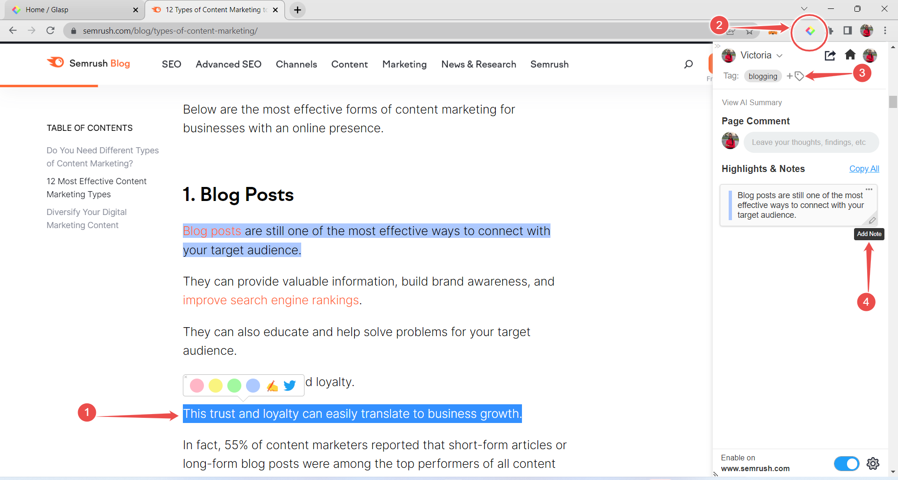
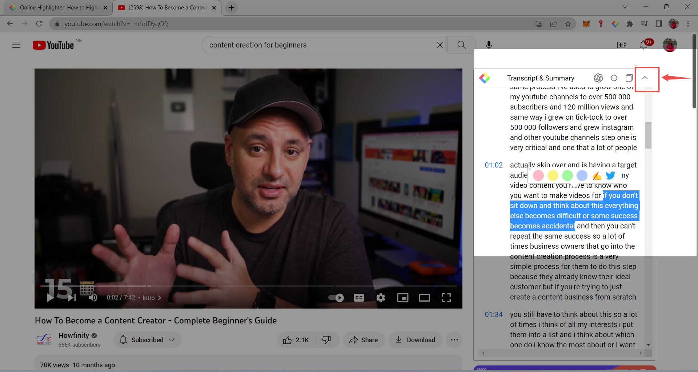
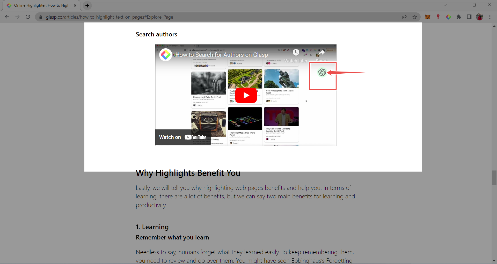
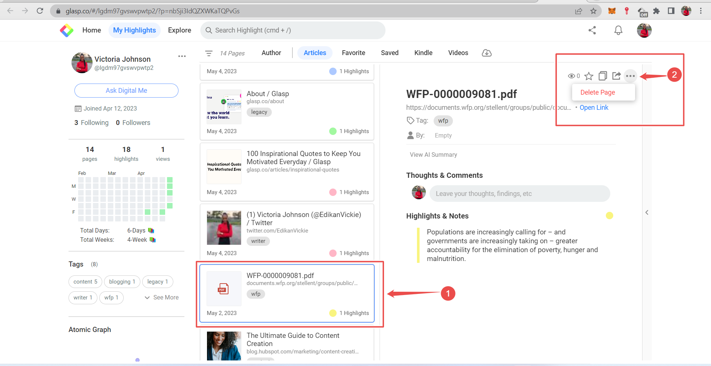
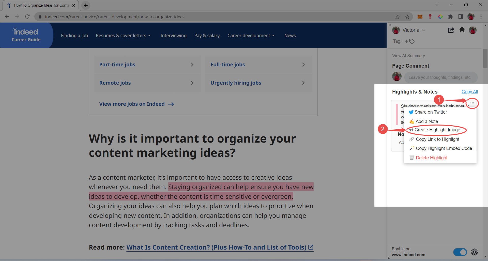
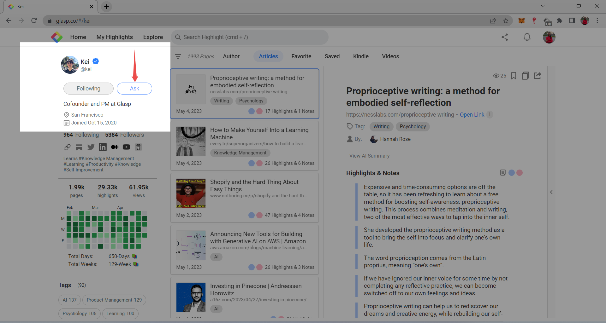
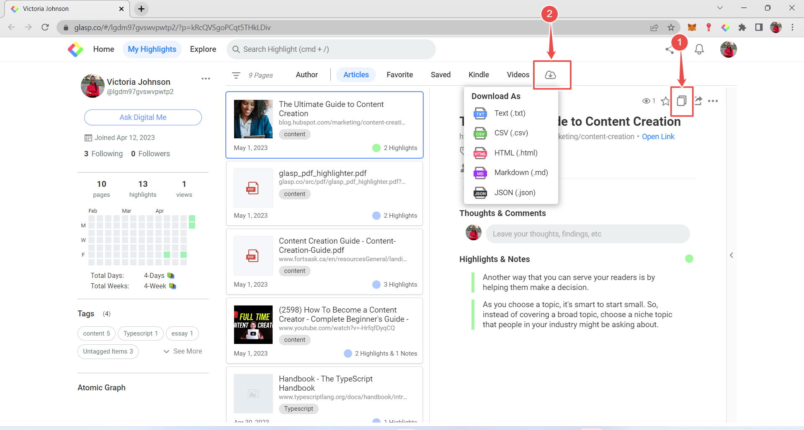
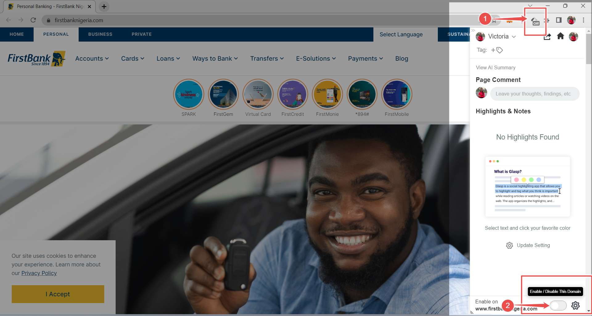

# How to Highlight Online with Glasp - A Beginner's Guide

_Everything you need to know about Glasp as a beginner. Say goodbye to scattered online notes._

With the vast information available on the internet, there is a high tendency to get lost when there is too much to read. Imagine there was a tool that helps you to pick out the most important information and save it in an accessible place. With this tool, you get to highlight on web pages when reading articles, and on PDFs, and it also summarizes long articles and YouTube videos, when you are rushing to get important information.

Glasp, also known as Greatest Legacy Accumulated as Shared Proof, is a free online highlighter that provides an effective way to organize and access information online, making it easier and more productive when reading or researching online.

Glasp aims to solve the problem of isolation of knowledge by encouraging collective learning. It would be a huge loss for the next generation if they can't access what you have learned throughout your life.

## 5 REASONS WHY YOU SHOULD USE GLASP

It can be challenging to keep track of important information and remember where you found it. Glasp solves this problem and takes it further with innovative features that boost your productivity.

Here are 5 reasons you should use Glasp:

1. **Collaboration**: It allows you to share information with others, making it easier to work on group projects with colleagues or classmates.

2. **Easy to remember**: Many online highlighters do not have tagging and note-taking features, which helps you to add more context and make it easier to remember why the information was important.

3. **Saves time**: Contrary to the traditional way of copying and pasting from one webpage to another, Glasp helps you save time by quickly highlighting the content and save for future reference without leaving the webpage.
4. **Referencing and citations**: With Glasp you don't need to write down citations, all you need to do is highlight the content and add the authors directly on the highlight in your profile page. More on this later.
5. **Legacy**: This means leaving a lasting impact on the world. When you write on traditional notes, nobody gets to see your notes and insights, but with Glasp, you can share your knowledge with others. This benefits both you and your audience; it helps others learn and grow, builds your reputation, and can lead to new connections, collaborations, and opportunities.

## HOW TO HIGHLIGHT WITH GLASP

Highlighting is a simple process that allows you to save important information from webpages, PDFs, and videos. Follow these steps to start highlighting with Glasp:

1. **Visit** [Glasp website](https://glasp.co/home) and sign up for an account.

2. **Install** the Chrome extension and pin it to the toolbar.
3. Follow up to 10 topics that are of interest to you and connect with like-minded people that you want to learn from.
4. Now you can start highlighting online with Glasp.

> Glasp is also available on Microsoft Edge, Safari, Brave, and Opera web browsers.

## GLASP'S FEATURES THAT BOOST PRODUCTIVITY

For you to be productive, you should be able to efficiently and effectively use your time to complete tasks and achieve your goals. These Glasp features below allow you to be productive with less effort.

1. **Highlighting and grouping text on webpages**: When you find an important sentence or paragraph you need to save -

- **Highlight** the text and choose a color to save your highlight.

- **Click** on the Glasp icon in the toolbar and on the tag icon.
- **Type** your tag to make it easier to remember the highlight.
- **Hover** on the highlight in the sidebar and **Click** on the pencil icon.
- **Type** your notes that add context to the text you just highlighted.

Click on this [link](https://glasp.co/articles/how-to-highlight-text-on-pages) to practice how this works on articles.

2. **Highlighting on PDFs**: For now, this only works on PDFs hosted directly on web browsers and does not apply to downloaded documents on your local computer.

- **Open** the PDF file and **Click** on the Glasp icon on your right-hand side.

- You can now highlight, and add tags, notes, and authors.

Click on this [link](https://www.dunwoody.edu/pdfs/Elftmann_Highlighting.pdf) to practice how this works on PDFs.

3. **Highlighting YouTube videos**: You can save important points as you watch YouTube videos by -

- **Clicking** on the arrow pointing downwards as seen in the image below.

- **Highlighting** important notes you want to remember.
- Do not forget to add tags, notes, and the author.

Click on this [link](https://www.youtube.com/watch?v=-HrfqfDyqCQ&t=2s) to practice how this works on YouTube.

4. **Summarize text and video content**: When you have less time to read every word on webpages, and articles, or watch full videos either embedded or on YouTube, this tool gives you a summary of the content. To make this work -

- For text; **Click** on the Glasp icon in the toolbar, **Click** on 'View AI Summary' in the sidebar, and wait for it to load.

- For embedded videos; **Click** on the icon as seen in the image below and wait for it to load.
- For videos on YouTube; **Click** on the same icon as seen below and wait for it to load.
  For more information on how to customize your settings, watch [this](https://www.youtube.com/watch?v=qLwt-ZY2bDA&t=57s) video.

Click on this [link](https://glasp.co/articles/how-to-highlight-text-on-pages) to practice how this works on text and embedded videos.

5. **Deleting highlights and notes**: You can delete highlights and notes that are not relevant to you by -

- **Visiting** your [Glasp home page](https://glasp.co/home) and **Clicking** on your image icon to show your highlights.

- **Click** on the highlight and **Click** on the Menu icon to delete the page.

6. **Sharing knowledge**: When you come across an interesting sentence you want to share with others -

- **Highlight** the sentence and **Click** on the Glasp icon in the toolbar.

- **Click** on the share icon and **Share** on Twitter, Facebook, LinkedIn, or Email.

You can also create an image that is optimized for Twitter by -

- **Hovering** on the highlight in the sidebar and **Clicking** on the menu.

- **Select** 'Create Highlight Image' and explore the different color options.

7. **Ask Digital Me**: With this feature, you can ask a person any question. Glasp's AI will answer your question based on the content they share on their Glasp page. To do this -

- **Visit** [Glasp's home page](https://glasp.co/home) and **Search** for a profile.

- **Click** on 'Ask' on the left-hand side and a new tab will open.
- **Proceed** to Type in your question and **Press** 'Enter'.

8. **Exporting highlights and notes**: Your highlights and notes can be exported by copying and pasting them into your preferred place or document. To do this -

- **Visit** your [Glasp profile page](https://glasp.co/home), **Click** on your image icon, and on the copy icon as shown in the image below.

- Your content can also be downloaded in .txt, .CSV, .HTML, and JSON format by clicking on the download icon.

9. **Optional disabling**: When you are working on sensitive sites you don't want to share with others like your bank application, you can disable the highlighter by following these steps -

- **Click** on the Glasp icon in the toolbar.

- **Toggle** the button shown below.

> These features are only available on a desktop computer, but you can access your profile, highlights, and notes on your mobile device. They can only function when you have installed the browser extension on your local computer.

## CONCLUSION

Glasp is a free online highlighter that helps you pick the most important part of what you are reading and store it in one place, with this, you don't have to read the whole webpage once you need a piece of particular information. Also, each time you visit that website, you will see your previous highlights.

It is a major productivity tool for business people, students, researchers, and all other career fields that require consuming lots of information online.

Due to technical and security reasons, you cannot highlight on certain websites like Google products, or note-taking apps. To read more about this, visit [this](https://blog.glasp.co/disabled-domains/) site.

Did you find this interesting? What other thing do you want to know about Glasp? Indicate in the comments section.
Follow me on [Twitter](https://twitter.com/EdikanVickie) and [LinkedIn](https://www.linkedin.com/in/victoria-johnson-30495a197/) for more updates.
