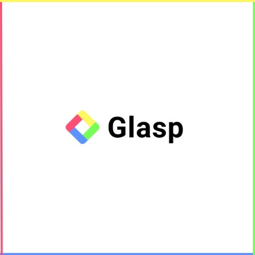

# How to Highlight Online with Glasp - A Beginner's Guide

Glasp is a free online highlighter that is used to save important information while users browse online. It also has exciting features that helps to remember the reason why the text or paragraph was saved.

For this to work, the browser extension must be installed and pinned to the browser toolbar.

This is a comprehensive article that is tailored to beginners. It covers how readers, researchers, writers, learners, and other career path can use Glasp to boost productivity and save time.

It also covers the features and how to use them.

There is no AI-generated content and was written with the [Google Developer's Documentation Style Guide](https://developers.google.com/style).

## Features

- Highlighting on webpages, PDFs, and YouTube video transcription.
- Grouping by adding tags and notes.
- Summarize text and video content
- Deleting highlights and notes
- Sharing on Twitter, LinkedIn, and Facebook
- Ask Digital Me
- Exporting highlights and notes
- Optional disabling

## Acknowledgements

- [Wisdom Nwokocha](https://twitter.com/Joklinztech)
- [Kei Watanabe](https://twitter.com/KeiWatanabe17)
- [Isaac Rejoice](https://twitter.com/IsaacRejoice2)

## Tool used

- [Annotely annotation tool](https://annotely.com/editor)

## FAQ

### Is Glasp free?

Yes, Glasp is a free online highlighter.

### Is it available on Mobile device?

Glasp is a browser extension, so it was designed for desktops but users can access their profile, feed, and contents on mobile devices.

### Why can't I use the highlighter on some websites?

Due to technical and security reasons, you can't access Glasp browser extension on some webpages.
